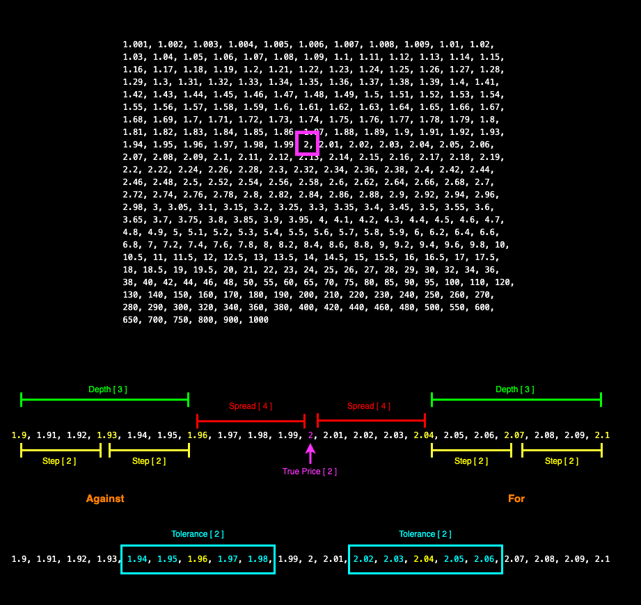

# Market Seeder

Tool for seeding markets on The Monaco Protocol. The tool makes use of the Monaco Protocol [seed-calculator](https://github.com/MonacoProtocol/seed-calculator) package.



Please aquatint yourself with the parameters outlined in the seed-calculator README as these are the same parameters used for this seeding tool.

# Setup

## Prerequisites

- [Solana CLI](https://docs.solana.com/cli/install-solana-cli-tools) for wallet generation
- [npm](https://docs.npmjs.com/downloading-and-installing-node-js-and-npm) to install dependencies
- [A CLI wallet](https://docs.solana.com/wallet-guide/file-system-wallet)
  - Be sure to note the publicKey of the wallets in order to fund them with SOL and the token(s) used for the markets you are seeding
  - Be sure to securely store your seed phrase
  - _Never_ commit your wallet to a repository

```
mkdir wallet
solana-keygen new -o wallet/seeder.json
```

⚠️ The `wallet` dir is specified in `.gitignore` to help ensure you do not commit your wallet ⚠️

## Installation

```
npm install
```

# Setting Environment

Environmental settings are configured in `.env` files in `.env/.env-*` there are two environments that you can connect to by exporting one of the following values:

```
export ENVIRONMENT=mainnet-release
export ENVIRONMENT=devnet-release
```

The examples in this repo use [anchor](https://github.com/coral-xyz/anchor) and each `.env` file sets an RPC-node with `ANCHOR_PROVIDER_URL`.

- The default one for `devnet` is a public example RPC-node subject to rate-limiting.
- The `mainnet` one is a placeholders and will need to be changed for a `mainnet` rpc node.
- For each, you should set yourself up with your own RPC-node.

## RPC-Nodes

Two providers you may wish to consider, who both offer free-tier RPCs are:

- [Helius](https://www.helius.xyz/)
- [Quicknode](https://www.quicknode.com/)


## Additional Environment Settings

In addition to your wallet path, solana program ID and RPC node information, the `.env` files also specify default values for your seeding and how you wish the seeder to perform.

- **Include Stake in Returns** (true/false)
  - Whether or not to include the stake/risk in the return calculations.
- **True Price**
  - The the mid-point on a market between _for_ and _against_ orders, all prices are calculated from this point on the price ladder.
- **Spread**
  - The first price on either side of the ladder from the true price.
- **Steps**
  - How many rungs up or down the ladder until the next price is determined.
- **To Return**
  - Amount to be returned from your _for_ order.
- **To Lose**
  - Amount to be returned from your _against_ order.
- **Depth Percentages**
  - Percentage of stake to place.
  - For example `[100, 75, 50]` will use `100%, 75%, 50%` of the calculated stake.
  - The number of percentages here also determines the `depth` of the pricing.

# Generate Seeding CSV

In order to generate a CSV to seed from run:

```
npm run generateSeedCsv <output csv name> <token name>
```

This will currently get all:

- Open markets
- Using the supplied token name for order placement

Some tokens have been mapped so you can pass in a shorthand name for them. Currently mapped tokens:

- Devnet: `wins`
- Mainnet: `usdt`

For any other token, pass in the full publicKey.

This script will generate a CSV breaking down the outcomes for each market, with default seeding values applied. You can then edit this file prior to running `seedOutcomesFromCsv`.

# Seeding From CSV

Following the generation of the CSv, you should edit the values to fulfil your seeding needs. The csv can be found in `/src/csvs/your_csv_name.csv`

⚠️ Market outcomes will only be seeded if the `seed` value in the csv reads `TRUE` ⚠️

In the example below, only the `Denver Nuggets` outcome would be seeded.

```
ABtq8rQNNRoXyqaNQUVNaubcR5PyFjucogZfvzUcGzbZ,35DX3LrSQ2i6FVenhEErqbWd6sTwp9hFmAve7A5uJDrn,Winner,EventResultWinner,Minnesota Timberwolves,0,2,2,2,100,100,"100,75,50",FALSE
ABtq8rQNNRoXyqaNQUVNaubcR5PyFjucogZfvzUcGzbZ,35DX3LrSQ2i6FVenhEErqbWd6sTwp9hFmAve7A5uJDrn,Winner,EventResultWinner,Denver Nuggets,1,2,2,2,100,100,"100,75,50",TRUE
```

To preview how your markets would seed, run the seeding script with a `false` flag.

```
npm run seedOutcomesFromCsv <csv name> false
```

If you are happy with the output of the dry run, you can then seed the markets by switching to a `true` flag.

```
npm run seedOutcomesFromCsv <csv name> true
```
